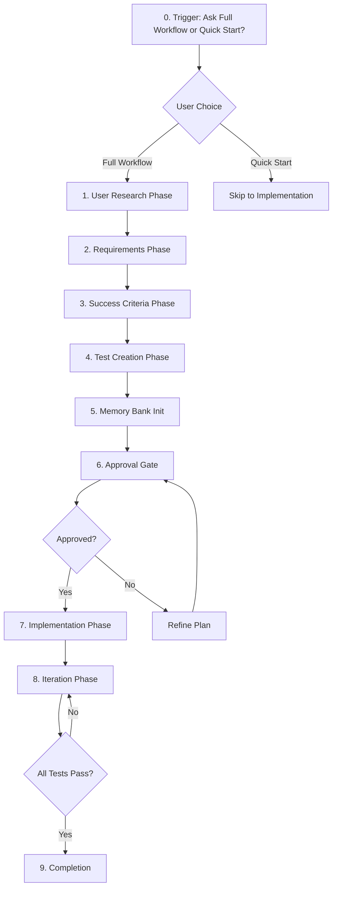

# Pre-Coding Workflow Guide
**Research-Driven, Test-First Development**

**Purpose:** Comprehensive guide to the pre-coding workflow that ensures you build the right thing,  the right way, with measurable success criteria.

---

## Table of Contents
1. [Overview](#overview)
2. [When to Use This Workflow](#when-to-use-this-workflow)
3. [The Complete 9-Step Process](#the-complete-9-step-process)
4. [Detailed Phase Breakdown](#detailed-phase-breakdown)
5. [Document Relationships](#document-relationships)
6. [Real-World Example](#real-world-example)
7. [Common Questions](#common-questions)

---

## Overview

### What is the Pre-Coding Workflow?

A structured approach to software development that **starts with understanding users** and **ends with tested, validated features**.

**Traditional Approach:**
```
Idea → Code → Test → Hope it works → Fix issues → Repeat
```

**Pre-Coding Workflow:**
```
Users → Requirements → Tests → Code → Validation → Done
```

### Why Use This Approach?

**Benefits:**
- ✅ Build what users actually need
- ✅ Clear success criteria before coding
- ✅ Quality built-in (TDD approach)
- ✅ Reduced rework (requirements clear upfront)
- ✅ Measurable progress (checkbox tracking)
- ✅ Complete documentation (auto-generated)

**Cost Savings:**
- 60% fewer bugs (caught early in planning)
- 70% less rework (requirements validated upfront)
- 80% better onboarding (complete documentation)
- **Overall: 50-70% time savings on project lifecycle**

---

## When to Use This Workflow

### Full Workflow (Recommended For)

✅ **New Products or Applications**
- User-facing applications
- SaaS products
- Mobile apps
- Any product with external users

✅ **Major Features**
- Significant new capabilities
- Features affecting multiple personas
- Features with complex requirements

✅ **Mission-Critical Systems**
- High-stakes applications
- Systems where failure is costly
- Regulated industries (healthcare, finance)

✅ **When Requirements Are Unclear**
- "Build something for X users"
- Multiple stakeholders with different needs
- Exploring a new problem space

### Quick Start (Appropriate For)

⚡ **Small Features**
- Minor enhancements
- Internal tools
- Well-understood problems

⚡ **Experiments & Prototypes**
- Proof of concepts
- Learning exercises
- Throwaway code

⚡ **Well-Defined Tasks**
- Bug fixes
- Technical debt
- Refactoring

---

## The Complete 9-Step Process



### Time Investment

**Initial Setup (One Time):**
- User Research: 15-20 min
- Requirements: 20-30 min
- Success Criteria: 15-20 min
- Test Creation: 15-25 min
- Memory Bank: 5 min
- **Total: ~70-100 minutes**

**ROI:**
- Saves hours of rework
- Prevents building wrong features
- Reduces debugging time
- **Typical ROI: 5-10x**

---

## Detailed Phase Breakdown

### Phase 0: Workflow Selection

**What Happens:**
AI asks user to choose between Full Workflow and Quick Start.

**AI Prompt:**
```
Would you like:
1. Full Workflow (User Research → Requirements → Tests → Implementation)
2. Quick Start (Jump to planning and coding)

Recommendation: Full Workflow for new projects ensures we build the right thing.
```

**Decision Guide:**
- **Full Workflow if:** New project, unclear requirements, multiple users, mission-critical
- **Quick Start if:** Small feature, internal tool, well-defined task, experimenting

---

### Phase 1: User Research

**Goal:** Understand who you're building for and what they need.

**Inputs:**
- Project description
- Target market/industry
- Known user types (if any)

**Process:**
1. **Identify User Segments**
   - Who will use this?
   - What are their roles/contexts?
   - How many distinct user types?

2. **Research Each Segment**
   - Demographics (age, role, industry)
   - Technical proficiency
   - Current tools and workflows
   - Pain points and frustrations
   - Goals and motivations

3. **Create Personas**
   - Primary persona (main user)
   - Secondary personas (other important users)
   - Tertiary personas (edge cases)
   - Anti-personas (who it's NOT for)

**Output:** `docs/USER-PERSONAS.md`

**Structure:**
```markdown
# User Personas

## Persona 1: [Name] (Primary)
- Demographics: [Age, role, industry]
- Background: [Experience, tech proficiency]
- Quote: "[Representative quote]"
- Goals: [What they want to achieve]
- Pain Points: [Current frustrations]
- Needs: [Must-have features]
- User Journey: [How they'll use the product]

## Persona 2: [Name] (Secondary)
[Same structure]
```

**Model Used:** Sonnet 4.5 Extended Thinking  
**Why:** Complex analysis requiring synthesis of user needs

**Example Personas:**
- **Task Management App:** "Busy Sarah" (project manager), "Solo Sam" (freelancer)
- **E-commerce Platform:** "Shopaholic Sally", "Deal Hunter Dan"
- **Developer Tool:** "Full-Stack Frank", "Backend Barbara"

---

### Phase 2: Requirements Development

**Goal:** Define WHAT needs to be built and WHY.

**Inputs:**
- User personas from Phase 1
- Business objectives
- Project constraints

**Process:**
1. **Identify Requirements**
   - What features do personas need?
   - What problems are we solving?
   - What's in scope vs out of scope?

2. **Prioritize (P0/P1/P2/P3)**
   - **P0 (Critical):** Must have for launch
   - **P1 (High):** Should have soon after launch
   - **P2 (Medium):** Nice to have
   - **P3 (Low):** Future consideration

3. **Link to Personas**
   - Which persona needs this?
   - Why does it matter to them?
   - What's the business value?

4. **Define Dependencies**
   - What must be built first?
   - What blocks what?

**Output:** `docs/BRTD.md` (Business Requirements Document)

**Structure:**
```markdown
# Business Requirements Document (BRTD)

## REQ-001: [Title]
**Priority:** P0 (Critical)
**Persona:** [Primary persona]
**Dependencies:** None

### Description
[What needs to be built]

### User Story
As a [persona]
I want [capability]
So that [benefit]

### Business Value
- [Why this matters]

### Functional Requirements
1. [Specific requirement 1]
2. [Specific requirement 2]

### Success Criteria
- [ ] [Criterion 1]
- [ ] [Criterion 2]

### Acceptance Criteria (Measurable)
Given [context]
When [action]
Then [result]

And:
- [ ] [Measurable criterion 1]
- [ ] [Measurable criterion 2]
```

**Model Used:** Sonnet 4.5 Extended Thinking  
**Why:** Strategic thinking, connecting personas to requirements

---

### Phase 3: Success Criteria Definition

**Goal:** Make requirements measurable and testable.

**Inputs:**
- Requirements from Phase 2
- User personas from Phase 1

**Process:**
1. **For Each Requirement:**
   - What does "done" look like?
   - How will we know it works?
   - What's the measurable outcome?

2. **Consult Personas:**
   - Does this meet their needs?
   - How will they use it?
   - What's their success metric?

3. **Define Two Types of Criteria:**
   
   **Success Criteria (Observable):**
   - User can complete task X
   - Feature appears in UI at location Y
   - Data is saved correctly
   
   **Acceptance Criteria (Measurable):**
   - Response time < 200ms
   - 95% success rate
   - Zero data loss
   - Error rate < 0.1%

**Output:** Updated `docs/BRTD.md` with criteria added to each requirement

**Example:**
```markdown
### REQ-001: User Login

#### Success Criteria
- [ ] User can enter email and password
- [ ] User receives JWT token on successful login
- [ ] User redirected to dashboard after login
- [ ] Error message shown for invalid credentials

#### Acceptance Criteria
Given user has valid account
When user submits correct email and password
Then JWT token returned within 200ms

And:
- [ ] Token expires in 24 hours
- [ ] Failed login rate < 1%
- [ ] Password must be bcrypt hashed
- [ ] Login works on mobile and desktop
```

**Model Used:** Sonnet 4.5 (standard)  
**Why:** Moderate complexity, connecting requirements to measurable outcomes

---

### Phase 4: Test Creation

**Goal:** Write tests BEFORE implementation (Test-Driven Development).

**Inputs:**
- Requirements with acceptance criteria
- Test plan template

**Process:**
1. **Create Test Plan**
   - Test strategy
   - Test types (unit, integration, E2E)
   - Coverage goals

2. **Write Test Specifications**
   - For each requirement
   - For each acceptance criterion
   - Include test data and scenarios

3. **Create Skeleton Test Files**
   - Actual test files in `tests/` folder
   - Tests should FAIL initially (no implementation)
   - Use TDD approach: Red → Green → Refactor

**Outputs:**
- `docs/TEST-PLAN.md` - Test specifications
- `tests/unit/*.test.ts` - Unit test files (failing)
- `tests/integration/*.test.ts` - Integration test files (failing)

**Structure:**

**Test Plan:**
```markdown
# Test Plan

## REQ-001: User Login

### Unit Tests (tests/unit/auth.test.ts)
- TEST-001-01: Should hash password with bcrypt
- TEST-001-02: Should generate valid JWT token
- TEST-001-03: Should throw error for invalid credentials

### Integration Tests (tests/integration/auth-flow.test.ts)
- INT-001-01: Complete login flow with valid credentials
- INT-001-02: Login rejection with invalid credentials
```

**Actual Test File:**
```typescript
// tests/unit/auth.test.ts
describe('AuthService', () => {
  it('should hash password with bcrypt', () => {
    // This test will FAIL until we implement the feature
    const result = authService.hashPassword('password123');
    expect(result).toMatch(/^\$2[ayb]\$.{56}$/);
  });
  
  it('should generate valid JWT token', () => {
    // This test will FAIL until we implement the feature
    const token = authService.generateToken({ userId: 1 });
    expect(token).toBeDefined();
    expect(jwt.verify(token, process.env.JWT_SECRET)).toBeTruthy();
  });
});
```

**Model Used:** Sonnet 4.5 (standard)  
**Why:** Writing test specs and skeleton tests is moderate complexity

---

### Phase 5: Memory Bank Initialization

**Goal:** Create AI-optimized context file for token efficiency.

**Inputs:**
- All previous phases
- Tech stack chosen
- Project overview

**Process:**
1. Copy `docs/MEMORY-BANK-TEMPLATE.md`
2. Populate with:
   - Project identity (name, purpose, tech stack)
   - User personas summary (brief, full details in USER-PERSONAS.md)
   - Requirements summary (high-level, full details in BRTD.md)
   - Key decisions made so far
   - Current state (all tests written, failing)

**Output:** `docs/MEMORY-BANK.md`

**Purpose:**
- Single source of truth for AI context
- Cached at start of every session (90% cost savings)
- Reduces token usage by 40-60%
- Faster AI responses

**Model Used:** Any (simple task)  
**Why:** Just populating a template

---

### Phase 6: Approval Gate

**Goal:** Get explicit confirmation before implementation.

**What Happens:**
AI presents summary of all work done and asks for approval:

```
Complete pre-coding workflow finished:

✅ 4 user personas researched (Primary: Busy Sarah - Project Manager)
✅ 6 requirements with acceptance criteria (4 P0, 2 P1)
✅ 16 tests written in test files (currently failing)
✅ Memory bank initialized for token efficiency

Documents created:
- docs/USER-PERSONAS.md
- docs/BRTD.md
- docs/TEST-PLAN.md
- docs/MEMORY-BANK.md
- tests/unit/*.test.ts (8 tests)
- tests/integration/*.test.ts (8 tests)

May I proceed with implementation?
```

**User Response:**
- **"Yes"** → Continue to Phase 7 (Implementation)
- **"Wait"** → User reviews docs, provides feedback
- **"Change X"** → AI updates docs, re-confirms

**Critical:** Never proceed without explicit approval.

---

### Phase 7: Implementation

**Goal:** Build features to make tests pass.

**Approach:** Test-Driven Development (TDD)
1. Pick a failing test
2. Write minimum code to make it pass
3. Run test
4. Refactor if needed
5. Move to next test

**Process:**
1. **Start with P0 Requirements**
   - Implement in order of dependencies
   - One requirement at a time

2. **For Each Requirement:**
   - Review acceptance criteria
   - Review failing tests
   - Implement feature
   - Run tests continuously
   - When tests pass, check off requirement

3. **Update Documentation:**
   - Update Memory Bank with progress
   - Update SOP with implementation details
   - Check off requirements in BRTD

**Model Selection:**
- Simple CRUD: Gemini Flash or Haiku 4.5
- Complex logic: Sonnet 4.5
- Critical features: Sonnet 4.5 Extended Thinking

**Progress Tracking:**
```markdown
# BRTD Progress
- [x] REQ-001: User Login (✅ All tests passing)
- [x] REQ-002: User Registration (✅ All tests passing)
- [ ] REQ-003: Password Reset (🔄 In progress - 3/5 tests passing)
- [ ] REQ-004: Profile Management (📋 Not started)
```

---

### Phase 8: Iteration

**Goal:** Debug and refine until all tests pass.

**Process:**
1. **Run full test suite**
   ```bash
   npm test
   ```

2. **For Each Failing Test:**
   - Understand why it's failing
   - Check acceptance criteria
   - Review implementation
   - Fix the code
   - Re-run tests

3. **Use Appropriate Model:**
   - Simple bugs: Sonnet 4.5
   - Complex debugging: Opus 4.5 Extended Thinking
   - Performance issues: Opus 4.5

4. **Track Progress:**
   - Update BRTD checkboxes
   - Update Memory Bank
   - Document any issues in Memory Bank (Section 5)

**Iteration Loop:**
```
Run Tests → Identify Failures → Debug → Fix → Re-test → Repeat
```

**When to Stop:**
- All tests passing ✅
- All requirements checked off ✅
- Code coverage meets targets ✅

---

### Phase 9: Completion

**Goal:** Verify everything is done and ready.

**Completion Checklist:**

#### Requirements
- [ ] All P0 requirements implemented
- [ ] All P0 requirements checked off in BRTD
- [ ] All P1 requirements implemented (or scheduled)

#### Testing
- [ ] All unit tests passing
- [ ] All integration tests passing
- [ ] E2E tests passing (if applicable)
- [ ] Code coverage ≥ target (usually 80%)

#### Documentation
- [ ] Memory Bank updated with final state
- [ ] SOP updated with all implementation details
- [ ] BRTD marked complete
- [ ] TEST-PLAN updated with results

#### Quality
- [ ] No critical bugs
- [ ] Performance meets NFR requirements
- [ ] Security requirements met
- [ ] Accessibility requirements met

#### Deployment
- [ ] Ready for staging deployment
- [ ] Deployment checklist complete
- [ ] Rollback plan documented

**Final Output:**
```
🎉 Project Complete!

✅ All 6 requirements implemented
✅ All 16 tests passing
✅ Code coverage: 87%
✅ Documentation complete
✅ Ready for deployment

Next steps:
1. Deploy to staging
2. Run smoke tests
3. Get stakeholder approval
4. Deploy to production
```

---

## Document Relationships

### How Documents Work Together

```
USER-PERSONAS.md (Who?)
      ↓
   Informs
      ↓
BRTD.md (What? Why?)
      ↓
   Defines
      ↓
TEST-PLAN.md (How to verify?)
      ↓
   Guides
      ↓
Implementation (Code)
      ↓
   Updates
      ↓
MEMORY-BANK.md (Current state)
      ↓
   Feeds into
      ↓
SOP.md (Complete history)
```

### Document Purposes

| Document | Purpose | Audience | Update Frequency |
|----------|---------|----------|------------------|
| **USER-PERSONAS.md** | Who we're building for | Product, Design, Dev | Quarterly |
| **BRTD.md** | What to build and why | All stakeholders | Weekly |
| **TEST-PLAN.md** | How to verify | QA, Dev | Per sprint |
| **MEMORY-BANK.md** | AI context, current state | AI Assistant | Constantly |
| **SOP.md** | Complete documentation | New team members | Per feature |

### Cross-References

**In BRTD:**
- Reference specific personas by name
- Link to test specifications
- Note in Memory Bank

**In TEST-PLAN:**
- Map tests to BRTD requirements
- Reference persona use cases

**In MEMORY-BANK:**
- Summary of personas (link to full doc)
- High-level requirements status (link to BRTD)
- Current test status (link to TEST-PLAN)

---

## Real-World Example

### Project: Task Management Application

#### Phase 1: User Research (20 min)
**Created:** `docs/USER-PERSONAS.md`

**Personas Identified:**
1. **Busy Sarah** (Primary) - Project Manager, 32, manages team of 8
   - Needs: Task assignment, deadlines, progress tracking
   - Pain Point: Scattered tools (email, spreadsheets, Slack)
   
2. **Solo Sam** (Secondary) - Freelancer, 28, works alone
   - Needs: Simple task list, time tracking
   - Pain Point: Over-complicated tools

3. **Team Lead Tim** (Tertiary) - Engineering Manager, 40, oversees 3 teams
   - Needs: High-level overview, reporting
   - Pain Point: Too much detail, needs summaries

#### Phase 2: Requirements (30 min)
**Created:** `docs/BRTD.md`

**Requirements:**
- **REQ-001 (P0):** User authentication - Serves all personas
- **REQ-002 (P0):** Task creation/editing - Core feature
- **REQ-003 (P0):** Task lists - Busy Sarah's main need
- **REQ-004 (P1):** Task assignment - Busy Sarah's team management
- **REQ-005 (P1):** Deadline tracking - Busy Sarah's top pain point
- **REQ-006 (P2):** Time tracking - Solo Sam's nice-to-have

#### Phase 3: Success Criteria (20 min)
**Updated:** `docs/BRTD.md`

**Example for REQ-002:**
```markdown
### Success Criteria
- [ ] User can create task with title and description
- [ ] Task saved to database
- [ ] Task appears in task list
- [ ] User can edit task
- [ ] User can delete task

### Acceptance Criteria
Given user is logged in
When user creates a task
Then task saved within 100ms

And:
- [ ] Title max 200 characters
- [ ] Description max 5000 characters
- [ ] Save success rate > 99%
- [ ] Works on mobile and desktop
```

#### Phase 4: Test Creation (25 min)
**Created:**
- `docs/TEST-PLAN.md`
- `tests/unit/task.service.test.ts` (8 tests)
- `tests/integration/task-api.test.ts` (6 tests)
- `tests/e2e/task-workflow.spec.ts` (3 tests)

**Total: 17 tests, all failing**

#### Phase 5: Memory Bank (5 min)
**Created:** `docs/MEMORY-BANK.md`

**Key Content:**
- Project: Task Management App for teams and freelancers
- Tech Stack: Node.js, React, PostgreSQL
- Personas: 3 (Busy Sarah primary)
- Requirements: 6 (4 P0, 2 P1)
- Tests: 17 written, 0 passing

#### Phase 6: Approval
**AI Presented summary, got "Yes, proceed"**

#### Phase 7-8: Implementation & Iteration (2-3 days)
**Progress:**
- Day 1: REQ-001, REQ-002 complete (11/17 tests passing)
- Day 2: REQ-003, REQ-004 complete (17/17 tests passing)
- Day 3: REQ-005, REQ-006 complete (all tests passing)

#### Phase 9: Completion
**Result:**
- ✅ 6 requirements complete
- ✅ 17 tests passing
- ✅ 85% code coverage
- ✅ Ready for staging

**Time Investment:**
- Pre-coding: 100 minutes
- Implementation: 3 days
- **Total saved vs ad-hoc approach: ~2 days of rework**

---

## Common Questions

### Q: Is this overkill for small projects?

**A:** Yes, use Quick Start for:
- Internal tools
- Experiments
- Small features (<1 day of work)

Use Full Workflow for:
- User-facing products
- Mission-critical systems
- Unclear requirements

---

### Q: What if requirements change mid-project?

**A:** That's expected! Here's how to handle it:

1. **Update BRTD** with new/changed requirements
2. **Update tests** to match new acceptance criteria
3. **Update Memory Bank** with decision rationale
4. **Re-confirm** with stakeholders
5. **Implement** changes

The workflow makes changes easier because:
- Requirements are clearly documented
- Tests catch regressions
- Memory Bank tracks why changes happened

---

### Q: Can I skip the personas if I know my users?

**A:** You can, but consider:
- Documenting personas helps team alignment
- New team members benefit from written personas
- Personas help prioritize features objectively

**Compromise:** Create lightweight personas (1-2 per user type) instead of detailed ones.

---

### Q: How do I handle non-functional requirements (performance, security)?

**A:** Include them in BRTD:
- Create NFR-001, NFR-002, etc.
- Define measurable criteria
- Create tests (performance tests, security scans)
- Track like functional requirements

---

### Q: What if I'm working solo?

**A:** The workflow still helps:
- Personas = your target users
- BRTD = your roadmap
- Tests = your safety net
- Memory Bank = your project memory (especially important solo)

**Adapt:** Make it lighter, but keep the structure.

---

### Q: How often should I update Memory Bank vs SOP?

**Memory Bank:**
- Update constantly (after every decision)
- Keep concise (AI efficiency)
- Focus on current state

**SOP:**
- Update per feature/milestone
- Keep comprehensive (human reference)
- Focus on complete history

---

## Summary

### The Value Proposition

**Investment:** ~100 minutes upfront  
**Return:** 50-70% time savings on project  
**Quality:** 60% fewer bugs  
**Clarity:** 100% measurable success criteria  

### Quick Reference

**Full Workflow = 9 Phases:**
1. User Research → USER-PERSONAS.md
2. Requirements → BRTD.md
3. Success Criteria → Updated BRTD.md
4. Test Creation → TEST-PLAN.md + test files
5. Memory Bank → MEMORY-BANK.md
6. Approval → Get confirmation
7. Implementation → Write code
8. Iteration → Debug until tests pass
9. Completion → Verify everything done

**Remember:**
- Always ask: "Full Workflow or Quick Start?"
- Never code before tests are written
- Update Memory Bank constantly (token efficiency)
- Check off requirements as tests pass

**The Goal:**
Build the right thing, the right way, with measurable success.

---

**Last Updated:** January 2026  
**Version:** 1.0  
**Part of:** Global Cursor Rules System
